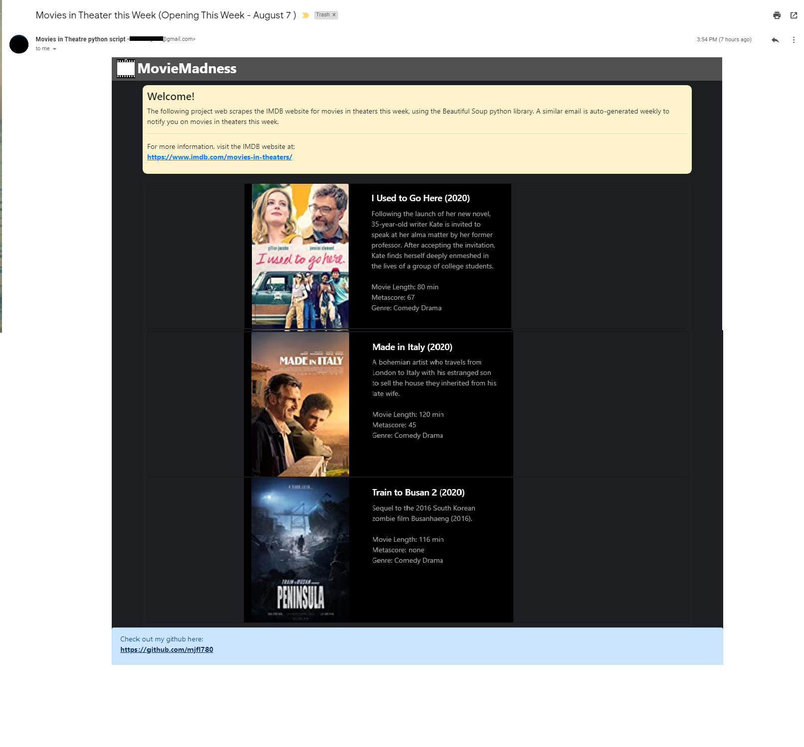

This program periodically sends you an email notification for movies in theatres pertaining to the week. The python program uses the BeautifulSoup python library to web scrape the IMDB website for movie information.

1. Run the python script 'App.py" to run the program.
2. Enter an email and password
3. Check your email imbox!

Program doesn't track your email or password input.
If you want to program to send emails periodically, keep the program running. The program depends on pythons time library to determine it's sleep time.
If you want to end the program, stop and exit the program.

This program web scrapes the IMDB website:
https://www.imdb.com/movies-in-theaters/

The program will send and email in the following form:

